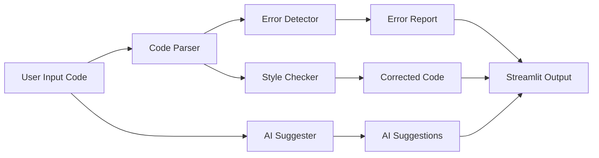

# 🤖 AI Code Reviewer

[](https://www.python.org/)
[](https://streamlit.io/)
[](https://github.com/)


---

## 🚀 Project Overview

**AI Code Reviewer** is a modern web application that enables developers and students to automatically review Python code using:

- **Syntax validation**
- **Logical error detection**
- **PEP8 style formatting**
- **AI-powered code suggestions**

Built with **Python + Streamlit**, this tool is ideal for:
- Beginners learning Python  
- Developers wanting instant code feedback  
- Students preparing for coding interviews  
- Anyone who wants cleaner, error-free code

---

## 🧠 Key Features

### ✔️ Code Analysis & Error Detection
- Detects syntax errors using AST parsing  
- Identifies common logical mistakes  
- Provides line-by-line error reports

### 🧹 PEP8 Code Formatting
- Auto-formats Python code  
- Ensures clean, readable, and standard-compliant code  
- Improves consistency across projects

### 🤖 AI-Powered Suggestions
- Generates improvement suggestions using LLM  
- Suggests better logic, structure, and readability  
- Helps in learning best practices

### 🧩 Interactive Streamlit UI
- Clean UI with tabs for:
  - Code Input
  - Errors
  - Suggestions
  - Corrected Code

---

## 🏗️ Architecture & Workflow



---

## 📂 Project Structure

```

ai-code-reviewer/
│
├── app.py                 # Main Streamlit application
├── code_parser.py         # Syntax parsing logic
├── error_detector.py      # Error detection module
├── style_checker.py       # PEP8 formatting module
├── ai_suggester.py        # AI suggestion generator
├── requirements.txt       # Project dependencies
├── .env                   # API keys (ignored in Git)
└── README.md              # Project documentation

````

---

## ▶️ How to Run the Project

### 1️⃣ Install dependencies
```bash
pip install -r requirements.txt
````

### 2️⃣ Run the Streamlit app

```bash
streamlit run app.py
```

### 3️⃣ Open in browser

After running, open the URL shown in the terminal
(usually: **[http://localhost:8501](http://localhost:8501)**)

---

## 📸 Output

* Displays syntax and logical errors
* Shows formatted Python code
* Provides AI suggestions for improvement

---

## 🎓 Use Cases

* Python learning and practice
* Automated code review
* Interview preparation
* Academic and mini-project submissions

---

## 🔗 Live Demo

Try the app online:

👉 https://ai-code-reviewer-bs94x85mpt6v85v7vdk67q.streamlit.app/
